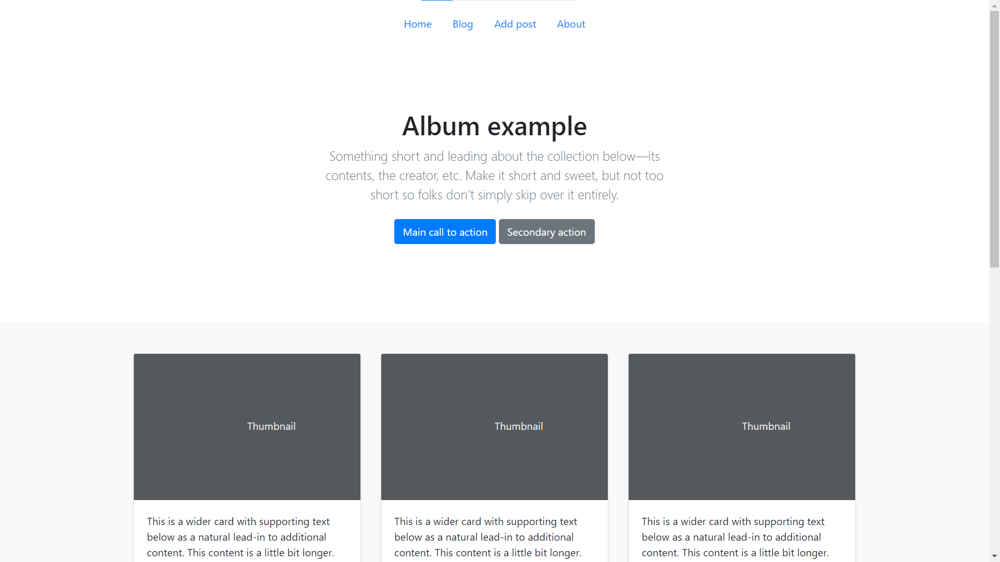
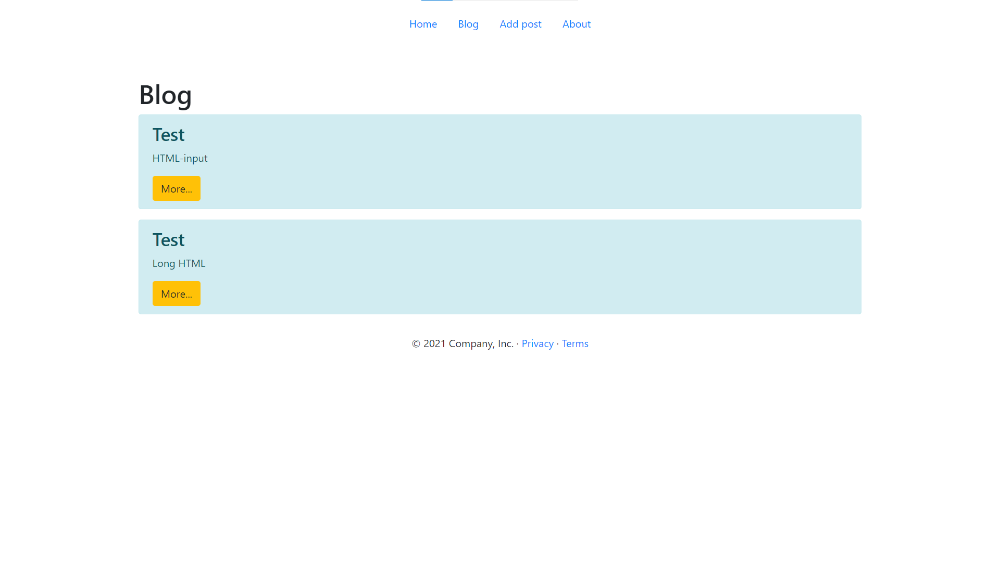
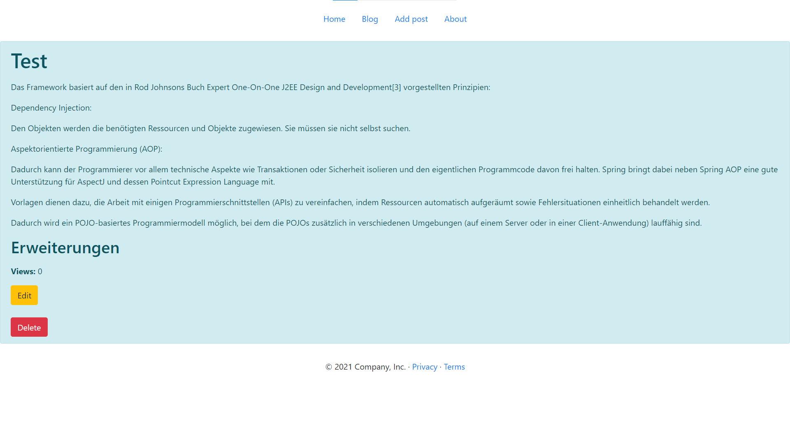
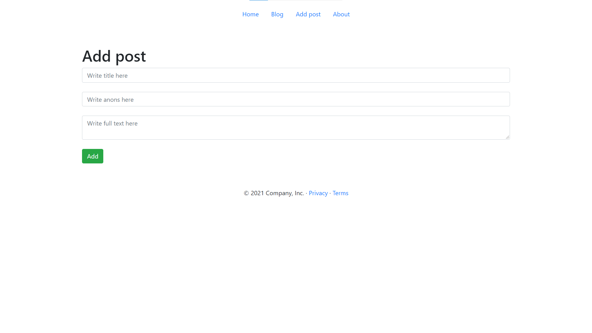
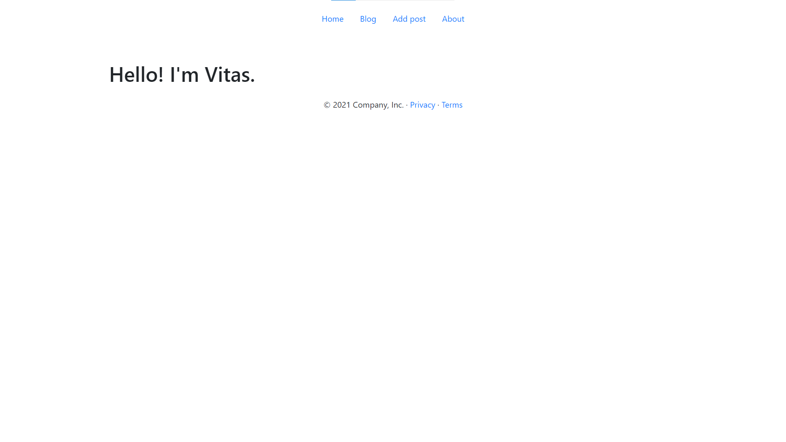

## FirstSpringBootProject

This web application was created as part of the [Java Spring Boot lessons](https://itproger.com/course/java-spring) and
is a simple web blog.

Here the functionality is implemented for displaying static web pages, dynamic web pages (using the Thymeleaf) and
working with the MySQL database (creating, editing and deleting blog articles).

The development of the user interface was carried out in conjunction with {username}.

This is my first Java Spring Boot application :)

## Content

- [Project structure](#Project-structure)
- [Technologies](#Technologies)
- [Screenshots](#Screenshots)

## Project structure

The frontend is located in
the [templates](https://github.com/VitasSalvantes/FirstSpringBootProject/tree/main/FirstSpringBootProject/src/main/resources/templates)
folder.
The [blocks](https://github.com/VitasSalvantes/FirstSpringBootProject/tree/main/FirstSpringBootProject/src/main/resources/templates/blocks)
folder contains frequently used parts of the HTML
code ([header](https://github.com/VitasSalvantes/FirstSpringBootProject/tree/main/FirstSpringBootProject/src/main/resources/templates/blocks/header.html)
and [footer](https://github.com/VitasSalvantes/FirstSpringBootProject/tree/main/FirstSpringBootProject/src/main/resources/templates/blocks/footer.html))
. This allows you to follow the [DRY (Don't Repeat Yourself)](https://en.wikipedia.org/wiki/Don%27t_repeat_yourself)
principle and insert these blocks using Thymeleaf.

The [controllers](https://github.com/VitasSalvantes/FirstSpringBootProject/tree/main/FirstSpringBootProject/src/main/java/com/vitassalvantes/firstspringbootproject/controllers)
folder contains all the required controllers.

The [models](https://github.com/VitasSalvantes/FirstSpringBootProject/tree/main/FirstSpringBootProject/src/main/java/com/vitassalvantes/firstspringbootproject/models)
folder contains a Post model, which is a blog post.

The [repo](https://github.com/VitasSalvantes/FirstSpringBootProject/tree/main/FirstSpringBootProject/src/main/java/com/vitassalvantes/firstspringbootproject/repo)
folder contains the interface (repository) for the Post model.

## Technologies

The programming language Java ([AdoptOpenJDK version 11.0.10](https://adoptopenjdk.net/))
and [Spring Boot](https://spring.io/projects/spring-boot#overview) were chosen for development.

Development was carried out in [IntelliJ IDEA](https://www.jetbrains.com/idea/) Ultimate Edition (license for students).

[Maven](https://maven.apache.org/) was used to build the project and inject dependencies.

[Thymeleaf](https://www.thymeleaf.org/) was chosen as the template engine.

[MySQL](https://www.mysql.com/de/) was chosen as the database. To run on a local server,
the [MAMP](https://www.mamp.info/de/windows/) program was used.

[Figma](https://www.figma.com/) program was used to prototype the user interface.

## Screenshots

Home page:

Blog page:

Post details page:

Add post page:

About page:

